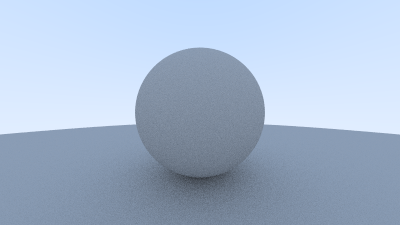
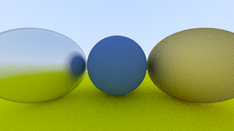
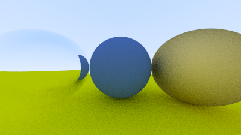
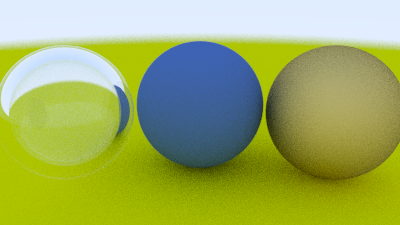

# Raytracer


*A render of concentric bubbles using the path tracer.*

A C++ raytracer implementation based on Peter Shirley's "Ray Tracing in One Weekend." This project demonstrates the fundamentals of physically based rendering (PBR), including path tracing, material scattering, and stochastic sampling.

## Project Structure

The codebase is organized into a modular structure:

-   **`src/`**: Contains the main application entry point.
    -   `main.cpp`: Sets up the scene (camera, world, materials) and runs the render loop.
-   **`include/`**: Header-only library files defining core components.
    -   `vec3.h`: 3D vector and point math logic (dot/cross products, unit vectors).
    -   `ray.h`: The `ray` class function $P(t) = A + tb$.
    -   `hittable.h` & `hittable_list.h`: Abstract base class and container for scene objects.
    -   `sphere.h`: Analytical intersection logic for spheres.
    -   `material.h`: Abstract `material` class with implementations for `lambertian`, `metal`, and `dielectric`.
    -   `camera.h`: Handles image generation, anti-aliasing (multisampling), and defocus blur (depth of field).
    -   `interval.h`: Utility for managing real-valued ranges.
    -   `color.h`: Utility for multi-sample color accumulation and gamma correction.

## Technical Implementation

### Core Ray Tracing Loop
The renderer uses a backward ray tracing approach. For each pixel in the viewport, multiple rays represent random samples within that pixel's area (anti-aliasing).

1.  **Ray Generation**: Rays are cast from the camera origin through the virtual viewport.
2.  **Intersection**: The ray is tested against all objects (`hittable_list`) in the scene. The closest hit point $t$ is recorded.
3.  **Scattering**: If a hit occurs, the material determines how the ray interacts:
    -   **Absorption**: The ray stops (e.g., black body).
    -   **Reflection/Refraction**: A new scattered ray is generated based on surface properties (roughness, refractive index).
    -   **Color Attenuation**: The ray's color is multiplied by the material's albedo.
4.  **Recursion**: The process repeats for the scattered ray until it hits the background or reaches a recursion depth limit (`max_depth`).

### Materials



*A render of a sphere using Lambertian reflectance.*

-   **Lambertian (Matte)**: Uses a rejection method to pick a random point in a unit sphere tangent to the hit point, approximating ideal diffuse reflection.



*A render of a metal sphere with added fuzziness.*

-   **Metal (Reflective)**: Reflects rays perfectly about the normal. Fuzziness is added by perturbing the reflected ray endpoint within a small sphere.



*A render of a refracted sphere using Snell's Law for refraction.*

-   **Dielectric (Glass)**: Uses Snell's Law for refraction. Schlick's approximation is implemented to simulate varying reflectivity at grazing angles so we ain't gotta do all that.

### Camera Features



*A render of a defocused sphere.*

-   **Defocus Blur**: Simulates a real camera lens by originating rays from a random point on a "defocus disk" rather than a perfect point, creating a shallow depth of field effect.
-   **Gamma Correction**: Colors are gamma-corrected (raised to power 1/2) before final output to ensure correct display on standard monitors.

## Features

-   **Shapes**: Spheres.
-   **Multithreading**: Parallel rendering using C++ threads for faster image generation.
-   **Global Illumination**: Indirect lighting via recursive scattering.
-   **Output**: PPM (Portable Pixel Map) image format.

## Performance

The project now supports multithreaded rendering, significantly reducing render times.

**Benchmark Results:**

| Version | Time (Real) | Speedup |
| :--- | :--- | :--- |
| Single-threaded | 24.79s | 1x |
| **Multithreaded** | **7.35s** | **3.37x** |

*Note: Benchmarked on an 8-core M1 Macbook Air.*

## Prerequisites

To build and run this project, you need:

-   A C++ compiler (GCC, Clang, or MSVC) supporting C++11 or later.
-   [CMake](https://cmake.org/) (optional, but recommended for building).

## Getting Started

1.  **Clone the repository:**
    ```bash
    git clone <repository-url>
    cd raytracer
    ```

2.  **Build using CMake:**
    ```bash
    mkdir build
    cd build
    cmake ..
    make
    ```

    *Alternatively, compile directly with g++:*
    ```bash
    g++ -o raytracer -I./include src/main.cpp
    ```

## Usage

Run the executable to generate the image. The output is redirected to standard output, so you should pipe it to a `.ppm` file.

```bash
./raytracer > image.ppm
```

This will create an `image.ppm` file in your current directory.

## Example Output

The resulting `image.ppm` can be viewed with most image viewers that support the PPM format (e.g., GIMP, IrfanView, or online converters). The header image above represents a typical scene generated by this raytracer.

## To-Do

- [x] Multi-threading
- [x] Render chrono
- [] BVH
- [] Mass-spring system